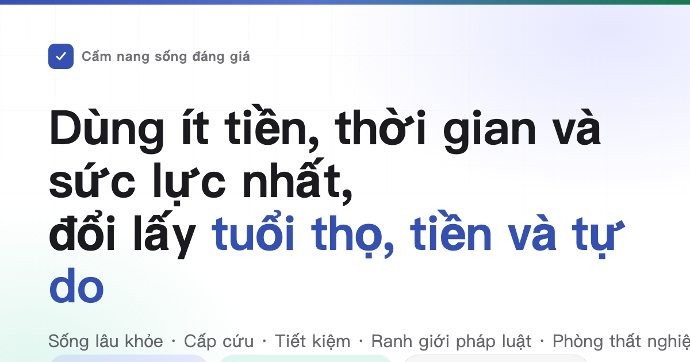

<div align="center">



# Cẩm nang sống đáng giá

Nói sống sao cho lâu, sao cho ít bệnh, xảy ngoài ý muốn cứu thế nào. Nói sao cho ít tiêu tiền oan, việc nào để người bị lừa, dính kiện tụng. Nói lúc không việc không tiền đi lĩnh được gì, mở tiệm, mở công ty, làm website phải làm thủ tục gì. Cũng nói yêu đương cưới sinh con, đi nước ngoài và học nghề.<br>
641 mục lời khuyên, mỗi mục viết rõ tiêu gì, đổi lại gì, chứng cứ cứng cỡ nào, nguồn chỉ trích luận văn tạp chí và văn kiện chính thức.

Đây là bản dịch tiếng Việt của sách gốc tiếng Trung HowToLiveBetter (upstream eternity4719/HowToLiveBetter). Nội dung pháp luật, trợ cấp và thủ tục trong sách chủ yếu là của Trung Quốc; chỗ nào chỉ dùng được cho bối cảnh Trung Quốc đều đánh dấu「Chỉ tham khảo TQ:」.

Không cần làm hết: đây là đơn chọn lựa đã sắp theo hiệu quả chi phí, không phải danh sách nhiệm vụ — nhặt đi một hai mục cũng tính, tác giả bản gốc cũng không làm được phần lớn trong đó.

[](https://chuanman2707.github.io/HowToLiveBetter/)
[](#mục-lục)
[](#phân-hạng-chứng-cứ)
[](docs/ghi-chep-kiem-chung/)
[](#giấy-phép)

### [Mở trang tra cứu trực tuyến](https://chuanman2707.github.io/HowToLiveBetter/) · [Cho AI trả lời theo sách (skill)](skills/life-decision-guide/README.md)

Skill trợ lý AI hỗ trợ Claude Code và Codex. Cài xong trực tiếp hỏi「có nên ký bảo lãnh cho bạn không」, nó tra mục trong sách trước rồi trả lời, và ghi rõ trích từ phần mấy mục mấy.

<table>
<tr><td align="right"><b>Tải về</b></td><td align="left">

[PDF](https://github.com/chuanman2707/HowToLiveBetter/releases/download/epub-latest/HowToLiveBetter.pdf) · [EPUB](https://github.com/chuanman2707/HowToLiveBetter/releases/download/epub-latest/HowToLiveBetter.epub) · [File đơn offline (HTML)](https://github.com/chuanman2707/HowToLiveBetter/releases/download/epub-latest/HowToLiveBetter.html)

</td></tr>
<tr><td align="right"><b>Tra xem</b></td><td align="left">

[Mục lục](#mục-lục) · [Bảng thuật ngữ](#đọc-hiểu-con-số-bảng-thuật-ngữ) · [Ghi chép kiểm chứng](docs/ghi-chep-kiem-chung/)

</td></tr>
<tr><td align="right"><b>Bài dài</b></td><td align="left">

[Cưới có đáng không](docs/cuoi-co-dang-khong.md) · [Danh mục đồ dùng khẩn cấp gia đình](docs/danh-muc-do-dung-khan-cap-gia-dinh.md) · [Gặp người lạ bị nạn có nên dừng lại](docs/gap-nguoi-la-bi-nan-co-nen-dung-lai.md) · [Làm nền tảng cần những giấy phép gì](docs/lam-nen-tang-can-nhung-giay-phep-gi.md) · [Nhịp đồng hồ sinh học và ca đêm](docs/nhip-dong-ho-sinh-hoc-va-ca-dem.md)

</td></tr>
</table>

</div>

---

## Cuốn sách này trả lời những câu hỏi nào

| Câu hỏi | Xem ở đâu |
| --- | --- |
| Gần như không tốn tiền mà hạ rõ rệt xác suất chết sớm, có những việc gì? | [1. Đừng chết sớm](book/01-dung-chet-som.md) |
| Thuốc lá, rượu, ngồi lâu, thức khuya rốt cuộc hao thọ bao nhiêu, thuốc và rượu cụ thể bỏ thế nào, dầu ăn nhà thường chọn dùng sao? | [2. Đừng chết từ từ](book/02-dung-chet-tu-tu.md) |
| Mỗi ngày tinh lực không đủ dùng, cứ bị ngắt, sửa thế nào? | [3. Đừng lãng phí sức lực](book/03-dung-lang-phi-suc-luc.md) |
| Thời gian tiêu đi đâu hết, làm sao ít làm việc không có ích, trì hoãn trị thế nào? | [4. Đừng lãng phí thời gian](book/04-dung-lang-phi-thoi-gian.md) |
| Tiền tích được nên để thế nào, mới không bị lãi suất, phí suất và trò lừa ăn mất? | [5. Đừng lãng phí tiền](book/05-dung-lang-phi-tien.md) |
| Những bảo kiện phẩm, gói khám thể, thuế trí thức nào trực tiếp không mua được? | [6. Danh sách nên tránh](book/06-danh-sach-nen-tranh.md) |
| Thất nghiệp rồi, bị thiếu lương rồi, trên người hết tiền rồi, lĩnh được gì, đi đâu cầu cứu? | [7. Sống khi không có tiền](book/07-song-khi-khong-co-tien.md) |
| Sính lễ, nhà trước cưới, khoản chuyển lớn thời yêu đương tính của ai, bị người báo án chỉ tố hay bịa đặt đầu tố lúc bước đầu làm gì, mình gây chuyện chủ động khai giảm được bao nhiêu án, về sau truy cứu và đòi bồi được không? | [8. Đừng tự chuốc họa vào thân: pháp luật và an toàn tài sản](book/08-dung-tu-chuoc-hoa-vao-than.md) |
| Những "việc tay trái" và việc nhỏ tiện tay nào để người thường biến thành bị cáo hình sự? | [9. Làn ranh đỏ pháp luật người thường dễ vi phạm](book/09-lan-san-do-phap-luat-de-vi-pham.md) |
| Theo đuổi người nên rải lưới rộng hay theo cứng một người, yêu xa thành được không, lĩnh chứng cưới mang gì? | [10. Yêu và cưới có đáng không](book/10-yeu-va-cuoi-co-dang-khong.md) |
| Viết loại code nào, nhận đơn nào sẽ bị phán án? | [11. Làn ranh đỏ dân lập trình và dân kỹ thuật dễ vi phạm](book/11-lan-san-do-cua-dan-ky-thuat.md) |
| Vay tiền mở tiệm, mở công ty trước nên nghĩ rõ nhất điều gì? | [12. Khởi nghiệp và làm ăn](book/12-khoi-nghiep-va-lam-an.md) |
| Có người ngã xuống hết hô hấp, chảy máu lớn, đám cháy, lạc đường, trước hết làm gì? | [13. Tình huống khẩn cấp: làm gì trước](book/13-tinh-huong-khan-cap.md) |
| Tài khoản bị đánh cắp, điện thoại mất rồi, bước đầu làm gì? | [14. Tài khoản và an toàn thông tin](book/14-tai-khoan-va-an-toan-thong-tin.md) |
| Tiền cọc bị khấu, chủ nhà đuổi người, chung cư cho thuê dài hạn nổ vỡ thì sao, muốn dọn về quê ở có mua được nhà nông thôn không? | [15. Thuê nhà và mua nhà](book/15-thue-va-mua-nha.md) |
| Sau khi xác chẩn bệnh mạn tính, dài hạn quản thế nào, ít tốn tiền thế nào? | [16. Sống sau khi mắc bệnh mạn tính](book/16-song-sau-khi-mac-benh-man-tinh.md) |
| Giám hộ, di chúc và tiền của người già nên an bài trước thế nào? | [17. Nhà có người già](book/17-nha-co-nguoi-gia.md) |
| Sinh con lĩnh được gì, chiếm bao nhiêu thời gian và tiền? | [18. Nuôi con có đáng không](book/18-nuoi-con-co-dang-khong.md) |
| Phí làm thêm giờ, phép năm tính thế nào, bị đuổi việc lấy bao nhiêu bồi thường, đi làm bị thương nhận định và lấy tiền thế nào? | [19. Đang làm, nghỉ việc và tai nạn lao động](book/19-di-lam-nghi-viec-va-tai-nan-lao-dong.md) |
| Con vừa sinh, mấy việc đòi mạng nhất là gì? | [20. Chăm trẻ sơ sinh thế nào](book/20-cham-tre-so-sinh.md) |
| Nước nào hiện đừng đi, xảy chuyện sứ quán lãnh sự quản tới bước nào? | [21. Đi nước ngoài, du lịch và an toàn ở nước ngoài](book/21-du-lich-va-an-toan-nuoc-ngoai.md) |
| Đi KTV, tiệm nét, mật thất sao cho không đạp hố, áp lực lớn làm gì hữu dụng nhất? | [22. Thư giãn thế nào: chỗ giải trí và giảm áp lực](book/22-thu-gian-the-nao.md) |
| Học hàn điện, học tiếng Anh, thi chứng, cái nào thật thu hồi vốn, học sao cho tỉnh thời gian, chức xưng từ đâu báo, đáng không? | [23. Học kỹ năng gì thì đáng](book/23-hoc-ky-nang-gi-dang.md) |
| Cùng một bệnh khám ở cộng đồng và khám ở bệnh viện cấp ba chênh bao nhiêu tiền, thương rất nặng lúc xếp hàng treo số hay tìm bàn phân chẩn cấp cứu, trị xong có nên làm giám định thương tật, làm thẻ khuyết tật không? | [24. Đi khám bệnh: sao cho ít tốn tiền ít đi đường vòng](book/24-di-kham-benh.md) |
| Người nhà qua đời rồi, lúc đó trước làm gì, tiền nào lấy lại được, phí nào có thể không đóng? | [25. Người thân qua đời rồi phải làm những việc gì](book/25-viec-phai-lam-khi-nguoi-than-qua-doi.md) |
| Làm website hay nền tảng thu tiền, phải làm giấy gì, máy chủ để đâu? | [26. Làm một website hay nền tảng](book/26-lam-mot-website-hoac-nen-tang.md) |
| Có thai rồi, sắp sinh rồi, lúc nào làm gì, trước xuất viện phải làm giấy gì? | [27. Mang thai và sinh con](book/27-mang-thai-va-sinh-con.md) |
| Muốn giảm cân, muốn đẹp lên, cách làm nào sẽ phá hỏng thân thể? | [28. Đừng vì ngoại hình phá hỏng sức khỏe](book/28-dung-vi-ngoai-hinh-pha-hong-suc-khoe.md) |
| Người thân mất rồi, bị đuổi việc rồi, cầm được chẩn đoán bệnh nặng, mấy tháng đầu đòi mạng nhất là gì? | [29. Sau khi gặp cú sốc lớn](book/29-sau-khi-gap-cu-soc-lon.md) |
| Con đi học rồi, việc thân thể và tâm lý nào không đợi tới sau thi xong mới nói được? | [30. Con cái tuổi đi học](book/30-con-cai-tuoi-di-hoc.md) |
| Sau mười tám tuổi ngoài đi học và đi làm còn mấy con đường nào, ngưỡng cửa mỗi con là gì? | [31. Sau tuổi mười tám có mấy con đường nào](book/31-nhung-con-duong-sau-tuoi-muoi-tam.md) |
| Du học nước ngoài, thân phận thị thực thế nào mới tính không đứt, về nước tấm bằng này nhận không? | [32. Du học nước ngoài: thân phận, làm thêm, bảo hiểm và chứng nhận hồi quốc](book/32-du-hoc-nuoc-ngoai.md) |
| Mình hay người nhà khuyết tật rồi, trước chặn chứng phát hợp nào, xin được trợ cấp nào, đi học đi làm và giám hộ làm thế nào? | [33. Sống thế nào sau khi khuyết tật](book/33-song-sau-khi-khuyet-tat.md) |
| Thuốc cảm, thuốc hạ sốt, thuốc dạ dày tự mua về ăn, loại nào không ăn cùng được, con nhỏ, phụ nữ mang thai và người già phải tránh loại nào? | [34. Thuốc sẵn trong nhà đừng để uống thành họa](book/34-thuoc-san-trong-nha-dung-de-uong-thanh-hoa.md) |

## Cách đọc

- **Không cần làm hết**: đây là một phần đơn chọn lựa đã sắp theo hiệu quả chi phí, không phải danh sách nhiệm vụ. Nhặt đi một hai mục cũng tính, phần còn lại cứ để, lúc cần quay lại tra. Đánh giá "nói dễ làm khó" là đúng — tác giả bản gốc cũng không làm được phần lớn trong đó, viết ra là để lúc cần dùng tìm được. Muốn nhặt loại tỉnh sức, xem điều "chỉ muốn xem đáng làm nhất" dưới đây.
- **Muốn AI tra giúp**: trong kho mang một skill ([skills/life-decision-guide](skills/life-decision-guide/)), Claude Code và Codex đều cài được. Cài xong trực tiếp hỏi "có nên ký bảo lãnh cho bạn không" "mỗi ngày đi làm hai tiếng đáng không". Nó trước đem mục liên quan tra ra từ chính văn, rồi theo cách tính sổ của sách sắp thứ tự trả lời, và ghi rõ trích từ phần mấy mục mấy. Tra không ra thì nói tra không ra, không tự biên số. Cách cài xem [lời nói của thư mục đó](skills/life-decision-guide/README.md).
- **Muốn lựa theo điều kiện**: mở [trang tra cứu trực tuyến](https://chuanman2707.github.io/HowToLiveBetter/), lọc được theo từ khóa, phần, hạng chứng cứ, cũng lọc được theo ba thứ "tốn tiền không, tốn bao nhiêu thời gian, cần ý chí không", mấy điều kiện xếp chồng dùng được. Nội dung trên trang trực tiếp lấy từ chính văn trong thư mục book/, chính văn đổi trang theo đổi.
- **Mục sẽ lẫn nhau chỉ đường** (kiểu "xem phần 8, mục 17"): trên trang tra cứu, loại chỉ đường này mang một đường gạch chân đứt. Bấm một cái, tại chỗ hiện tiêu đề và "Nói dễ hiểu" của mục bị trỏ. Muốn thật lật qua, lại bấm "nhảy qua". Mục đó vừa bị điều kiện lọc giấu, trang sẽ tự xóa lọc. Đọc chính văn trên GitHub trực tiếp bấm không động, nhưng sau mỗi chỗ chỉ đường đều viết chỉ tới cái gì ("xem mục 18 (mượn tiền viết rõ giấy mượn)"). Không lật qua cũng biết đang nói mục nào.
- **Muốn đọc theo thứ tự**: mục trong mỗi phần theo hiệu quả chi phí từ cao tới thấp sắp, từ mấy mục đầu mỗi phần xem là được.
- **Muốn xem offline, muốn gửi cho người**: tải [file đơn HTML offline](https://github.com/chuanman2707/HowToLiveBetter/releases/download/epub-latest/HowToLiveBetter.html), cả cuốn sách cùng tra cứu và lọc đều trong một file này, kích đúp là mở, không cần máy chủ cũng không cần nối mạng, trong Zalo cũng truyền trực tiếp được.
- **Muốn in hay lật trên điện thoại**: tải [PDF](https://github.com/chuanman2707/HowToLiveBetter/releases/download/epub-latest/HowToLiveBetter.pdf), dàn A4, hơn hai trăm trang, mang trang mục lục số trang và đánh dấu, mỗi phần bắt đầu trang mới.
- **Muốn đọc trên Kindle hay máy đọc khác**: tải [sách điện tử EPUB](https://github.com/chuanman2707/HowToLiveBetter/releases/download/epub-latest/HowToLiveBetter.epub), Kindle dùng Send to Kindle gửi qua là được.
- **Ba thứ đều sau mỗi lần chính văn cập nhật tự động sinh lại**, liên kết tải cố định không đổi; phần chuyển phát đi sẽ không theo cập nhật, lấy bản trực tuyến làm chuẩn.
- **Xem không hiểu chuỗi số đó**: mỗi mục có một dòng "Nói dễ hiểu". Nó đem cách viết trong nghiên cứu của cột "Lợi ích" dịch thành cách nói ngày thường kiểu "xác suất chết cùng kỳ thấp khoảng hai phần mười" "giam mấy ngày, phạt bao nhiêu tiền". Nó chỉ dùng nội dung cột "Lợi ích" đã viết tới, không thêm số mới. Chỉ xem dòng này là đủ định ý. Cột "Lợi ích" giữ nguyên toàn bộ số, muốn tự đối chiếu thì xem cột đó.
- **Chỉ muốn xem kết luận cứng nhất**: trên trang tra cứu tích hạng chứng cứ A, chỉ còn 424 mục có số cụ thể, từ tổng hợp phân tích hay thử nghiệm lớn.
- **Chỉ muốn xem đáng làm nhất**: tích hiệu quả chi phí "ROI: Very high", được 109 mục vừa không tốn tiền, không tốn thời gian, không cần ý chí, lợi ích lại rơi vào bậc lớn nhất. Xếp chồng thêm một "đổi về gì", chính là đơn ưu tiên dưới quy mô đó.
- **Thấy tiêu đề phần mở đầu bằng "đừng" đừng khẩn trương**: tiêu đề phần nói là việc phần này muốn chặn (đừng chết sớm, đừng lãng phí thời gian), không phải nói mỗi mục dưới đó đều bảo bạn đừng làm gì. Động tác thật phải làm viết trong tiêu đề mục, đều động từ mở đầu, tự viết rõ là "làm gì" hay "đừng làm gì". Cùng một phần hai loại đều có: phần 4 vừa có "đem 'định làm' viết thành 'mấy giờ, ở đâu, gặp gì liền làm gì'", cũng có "không xem ti vi và tin tức cuộn". Theo tiêu đề mục đọc, không cần lồng giọng điệu của tiêu đề phần vào.

Mỗi mục lời khuyên dài như vầy:

```markdown
### 5. Đổi muối ăn trong nhà sang muối natri thấp (muối kali)
- Chi phí: Một bịch đắt hơn muối thường mấy tệ. Mua lúc tiện tay đổi, không chiếm thời gian thêm. Khẩu vị cơ hồ không đổi.
- Nói dễ hiểu: Trong thử nghiệm ngẫu nhiên hai vạn người, người đổi muối nhà sang muối natri thấp, xác suất chết trong năm năm thấp khoảng 12%, trúng phong thấp khoảng 14%. Đây là ngẫu nhiên chia hai nhóm so ra, đáng tin hơn số chỉ theo dõi ghi chép.
- Lợi ích: Một thử nghiệm đem người ngẫu nhiên chia hai nhóm, làm ở nông thôn Trung Quốc, 20995 người, đều là người từng bị đột quỵ hay bệnh nhân cao huyết áp trên 60 tuổi, theo dõi 4,74 năm. Kết quả: nhóm dùng muối natri thấp so nhóm dùng muối thường, nguy cơ chết thấp khoảng 12% (RR 0.88). Đột quỵ thấp khoảng 14% (RR 0.86). Sự kiện tim mạch chính thấp khoảng 13% (RR 0.87).
- Mức chứng cứ: A
- Nguồn: Neal B et al. (2021). Effect of Salt Substitution on Cardiovascular Events and Death. NEJM. https://doi.org/10.1056/NEJMoa2105675
- Ghi chú: Tranh cãi. Đối tượng thử nghiệm là người già nguy cơ cao, người trẻ khỏe đổi muối được lợi nhỏ hơn nhiều. Người thận chức năng không đủ, hay người đang ăn thuốc giữ kali, đổi muối trước hỏi bác sĩ.
```

## Tự chạy một bản

Đa số người không cần triển khai: [trang tra cứu trực tuyến](https://chuanman2707.github.io/HowToLiveBetter/) sẵn có, muốn offline thì tải [file đơn HTML offline](https://github.com/chuanman2707/HowToLiveBetter/releases/download/epub-latest/HowToLiveBetter.html), kích đúp là mở.

Thật muốn chạy trên máy hay máy chủ mình:

```bash
git clone https://github.com/chuanman2707/HowToLiveBetter.git
cd HowToLiveBetter
python -m http.server 8000
```

Rồi trình duyệt mở `http://localhost:8000/`. Trang tra cứu thuần tĩnh, `README.md` và `book/` chính là dữ liệu của nó, không có hậu đài, không có cơ sở dữ liệu, không cần cài phụ thuộc; đem cả thư mục giao cho máy chủ tĩnh nào (Nginx, GitHub Pages, kho đối tượng) hiệu quả giống nhau. Chú ý `index.html` phải qua http mở, trực tiếp kích đúp file bản địa sẽ trắng — trình duyệt không cho trang web đọc file bản địa, trường hợp đó xin dùng bản file đơn offline ở trên.

Muốn tự sinh ba thứ bản điện tử (bình thường không cần, trong Release chính là tự động sinh ra):

```bash
cd tools/epub && npm ci && npm run build   # EPUB
node tools/offline/build.mjs               # file đơn HTML offline
node tools/pdf/build.mjs                   # PDF, riêng cần pandoc ≥ 3.1 và typst ≥ 0.13
```

Sản vật đều ở `dist/`.

## Bốn loại tài nguyên

Cuốn sách này muốn giúp bạn giữ lại nhiều không chỉ tuổi thọ, cộng bốn thứ:

- **Tuổi thọ**: sống lâu hơn, ít chết vì việc vốn tránh được
- **Thời gian và sức lực**: thời gian sống không tiêu vào việc không có hồi báo, sức chú ý và sức lực mỗi ngày ít bị hao trắng
- **Tiền**: ít tiêu tiền oan, đem tiền tiêu vào chỗ lợi ích xác định
- **Tự do thân người**: không vì không biết một làn ranh đỏ, đem mình đưa vào chỗ giam giữ hay khám tạm

Mỗi mục lời khuyên đều trả lời hai câu hỏi: phải tiêu gì (tiền/thời gian/tinh lực/ý chí), đổi về được gì (biến hóa tử suất tổng / nguyên nhân chết định điểm xuống / thời gian và tinh lực tỉnh / tiền tỉnh / bảo đảm và tự do thân người). Mục theo hiệu quả chi phí sắp, không theo loại sắp: gần như không tốn chi phí gì, lợi đổi về lại lớn, để trước nhất.

**Lợi của một mục lời khuyên rơi lên người nào, phân bậc.** Theo "phần lợi này sau này lớn cỡ nào khả năng quay lại trên chính bạn" từ cao tới thấp: ① **chính bạn**; ② **vợ/chồng và thân thuộc trực hệ** (cha mẹ, con cái, ông bà nội ngoại, cháu nội ngoại); ③ **bạn bè, đồng nghiệp và thân thích khác** — quan hệ hỗ hỗ, giúp ra đi sau này có thể quay lại; ④ **người lạ** — bậc thấp nhất, nhưng không phải không: xác suất hồi báo nhỏ, hơn nữa bạn không hiểu tính cách đối phương, còn có mặt bị ăn oan, bị cắn ngược, bị trả thù. Bậc khác không hợp nhất tính, viết tới bậc ④ lúc lợi và nguy cơ viết cùng nhau.

Phần cấp cứu chiếu cách này đọc: trong 38.227 ca tim ngừng ngoài viện của Trung Quốc 79,2% phát sinh trong nhà, học ấn ngực trước hết là để ấn lên người nhà mình; "thấy người chết đuối mình không xuống nước" "đụng đánh nhau đừng thượng thủ can" loại quy tắc này bản thân chính là quy tắc tự bảo, phòng là bạn từ người xem bên biến thành người bị thương thứ hai. Với người lạ ra tay hay không là cân đo của chính bạn, mục sẽ viết rõ điều miễn trách, động tác tự bảo và mặt nguy cơ, không thay bạn tính nó thành lý do bắt buộc làm.

Số của tử suất, số của thời gian tinh lực, số của tiền và hậu quả pháp luật, mỗi cái tính riêng, không quy đổi lẫn nhau. Bốn thứ này tương ứng bốn cái "đổi về gì" trên trang tra cứu, lẫn nhau không so lớn nhỏ.

## Phân hạng chứng cứ

Mỗi mục lời khuyên đều đánh dấu hạng chứng cứ:

| Hạng | Nghĩa |
| --- | --- |
| A | Có số cụ thể tra được, xuất xứ là tổng hợp phân tích gom nhiều nghiên cứu lại, đoàn hệ lớn theo dõi nhiều người nhiều năm, hay thử nghiệm phân nhóm ngẫu nhiên (RCT), nói ra được xuống bao nhiêu (HR, RR, phần trăm xuống) |
| B | Có nghiên cứu chống lưng, nhưng nói không ra một số xác thực; hay chỉ có cỡ mẫu nhỏ, một nghiên cứu riêng lẻ chống |
| C | Kinh nghiệm tác giả, hay cách làm mọi người công nhận, không có văn hiến nghiên cứu trực tiếp |

Trong 641 mục: A 424 · B 166 · C 51, có 58 mục đánh dấu tranh cãi, 2 chỗ cần xác minh. Mục cấp A/B có tranh cãi sẽ đánh dấu "Tranh cãi" và liệt chứng cứ phản phương. Mọi nguồn chỉ trích văn hiến sơ cấp (luận văn tạp chí kèm DOI hay liên kết PubMed, hay báo cáo cơ cấu chính thức như WHO/CDC/Tổng cục Thống kê), không trích chuyển thuật thứ cấp. Số không xác định đánh dấu "cần xác minh". Nội dung pháp luật TQ vẫn trích nguyên văn điều khoản và văn hiệu trong cột Nguồn.

## Các mức hiệu quả chi phí

Hạng chứng cứ chỉ trả lời "số này đáng tin không", không trả lời "việc này đáng làm không". Nên mỗi mục còn riêng đánh dấu hai thứ: đại lượng lợi ích (lợi lớn cỡ nào) và quy mô (đổi về loại nào). Trang tra cứu cầm hai thứ này cộng ba hạng chi phí, hợp ra một mức hiệu quả chi phí:

| Chiều | Trị lấy | Định thế nào |
| --- | --- | --- |
| Quy mô | đổi tuổi thọ / đổi tiền / đổi thời gian sức lực / đổi tự do thân người | Xem mục này chủ yếu đổi về cái gì. **Quy mô khác nhau không so sánh**, "tử suất tổng xuống 12%" và "mỗi năm tỉnh 500 tệ" không trên một cây thước, không phân cao thấp được |
| Đại lượng lợi ích | lớn / vừa / nhỏ | Cố chiếu cột "Lợi ích" của chính mục, theo ranh giới định sẵn áp, không theo cảm giác: đổi tuổi thọ xem xuống mấy phần trăm (≥20% là lớn, 10–20% là vừa, <10% hay chỉ đo tới chỉ tiêu trung gian mà chưa đo tới kết quả cuối là nhỏ); đổi tiền xem kim ngạch (vạn tệ cấp là lớn, trăm tới ngàn là vừa, chục tệ là nhỏ); đổi tự do thân người xem hậu quả (tránh trách nhiệm hình sự là lớn, tránh giam giữ hay xử phạt hành chính là vừa, tránh tranh nghị dân sự là nhỏ); đổi thời gian sức lực xem tỉnh bao nhiêu (mỗi ngày tỉnh ra giờ cấp là lớn, mỗi tuần giờ cấp là vừa, chỉ tỉnh một lần là nhỏ) |
| Hiệu quả chi phí | Very high / High / Moderate | Lợi lớn, ba hạng chi phí lại toàn không = cực cao; lợi lớn, chi phí không cao, hay lợi vừa, chi phí là không = cao; phần còn lại = trung bình |

Trong 641 mục theo hiệu quả chi phí: cực cao 109 (17%), cao 292 (46%), trung bình 240 (37%). Bậc giữa số mục nhiều là cố ý: đại lượng lợi ích dưới vốn chỉ chia ba cấp lớn, vừa, nhỏ, cắt tỉ hơn nữa là độ chuẩn xác gảy ra.

**Mức này là phán đoán của tác giả, không phải chứng cứ**, theo chuẩn sách này bản thân nó chỉ tính cấp C; nó và hạng chứng cứ là hai chuyện, ai cũng không ảnh hưởng ai. Một mục có thể chứng cứ cấp A mà hiệu quả chi phí chỉ tính trung bình (vắc-xin dải đồi có RCT kỳ ba hiệu lực 97,2%, nhưng hai mũi ba bốn ngàn tệ, dải đồi rất ít chí mạng), cũng có thể chứng cứ chỉ cấp C mà hiệu quả chi phí cực cao (trước xuất cảnh đem hành trình gửi người nhà). "Trung bình" không bằng không nên làm — mục toàn sách đều là khuyến nghị làm, chỉ là mức này phải bạn tự cân đo bút hao tốn đó đáng không.

## Đọc hiểu con số (bảng thuật ngữ)

Chính văn cố dùng cách nói ngày thường, nhưng trích nghiên cứu lúc miễn không được mấy danh từ thống kê. Xem không hiểu tra bảng này; trong trang tra cứu trực tuyến, đem con chuột dừng trên từ mang gạch chân đứt (trên điện thoại bấm một cái) cũng sẽ bật lời giải.

<details>
<summary>Mở 41 mục thuật ngữ (All-cause Mortality, HR, RR, 95% CI, Meta-analysis, BMI, LPR, Deposit vs. Earnest Money……)</summary>

| Thuật ngữ (EN) | Từ khóa trong nội dung (VI) | Nghĩa |
| --- | --- | --- |
| All-cause Mortality (ACM) | Tử suất tổng | Trong một đoạn thời gian, người chết trong một nhóm người chiếm bao nhiêu phần trăm, không quản chết vì nguyên nhân gì. Sách này dùng nó cân đo "sống lâu hay không". Trong nguyên văn nghiên cứu gọi tử suất toàn nguyên, viết tắt tiếng Anh ACM |
| Hazard Ratio (HR) | HR | Tỷ suất nguy cơ. Cùng một đoạn thời gian, nhóm người làm việc này xảy chuyện (chết, bệnh) nhanh chậm ra sao, chia cho nhóm không làm. HR 0.87 tức thấp hơn nhóm không làm 13%, HR 1.21 tức cao 21% |
| Relative Risk (RR) | RR | Nguy cơ tương đối. Tỷ suất khả năng xảy chuyện của hai nhóm người, cách đọc số giống HR |
| Odds Ratio (OR) | OR | Tỷ suất tỉ số chênh. Cũng là so sánh hai nhóm, chỉ cách tính hơi khác RR chút: việc cần so rất hiếm gặp lúc, nó và RR không sai biệt mấy; việc đó rất thường gặp lúc, nó sẽ nói khoảng chênh lớn hơn thật tế |
| Incidence Rate Ratio (IRR) | IRR | Tỷ suất suất phát bệnh. Suất phát bệnh là trong một đoạn thời gian người mới mắc bệnh này chiếm bao nhiêu phần trăm, hai nhóm tương trừ, cách đọc giống RR |
| Rate Ratio (RaR) | RaR | Tỷ suất số lần phát sinh. So là chuyện phát sinh bao nhiêu lần (ví dụ ngã bao nhiêu vố), không phải bao nhiêu người xảy chuyện, cách đọc giống RR |
| Standardized Mortality Ratio (SMR) | Tỷ suất tử vong chuẩn hóa | Viết tắt tiếng Anh SMR. Nhóm người này thật tế chết bao nhiêu người, chia cho "người thường cùng tuổi đáng lẽ chết bao nhiêu người". 5.86 tức số người chết gấp 5.86 lần người đồng tuổi |
| Absolute Risk Difference | Chênh nguy cơ | Xác suất xảy chuyện hai nhóm tương trừ, trực tiếp ra "mỗi ngàn người nhiều ra mấy người". Số gấp chỉ nói gấp mấy lần, chênh nguy cơ nói là thật thực nhiều ra bao nhiêu người |
| 95% Confidence Interval (95% CI) | 95% CI | Khoảng tin cậy 95%. Số nghiên cứu tính ra luôn có sai số, đây là phạm vi tình huống thật rất có thể rơi vào. Số loại số gấp, phạm vi vượt qua 1; số loại cộng trừ, phạm vi vượt qua 0, tức chênh lệch hai nhóm có thể chỉ là đụng phải, trong văn sẽ viết "không có ý nghĩa thống kê" |
| Randomized Controlled Trial (RCT) | RCT | Thử nghiệm đối chứng ngẫu nhiên. Dùng cách giống rút thăm đem người chia hai nhóm, một nhóm làm việc này, một nhóm không làm, sau đó so kết quả chênh bao nhiêu. Muốn chứng minh "chính việc này khởi tác dụng", cách làm này sức thuyết phục nhất |
| Meta-analysis | Tổng hợp phân tích | Đem kết quả rất nhiều hạng nghiên cứu gom lại tính lại, ra một số tổng. Cũng gọi phân tích meta |
| Cohort Study | Đoàn hệ | Nghiên cứu đoàn hệ. Lựa một nhóm lớn người theo dõi nhiều năm, ghi chép ai xảy chuyện. Nhìn ra được hai việc thường cùng xuất hiện, nhưng chưa đủ chứng minh là cái trước tạo thành cái sau |
| Observational Study | Quan sát tính | Nghiên cứu quan sát tính. Người nghiên cứu chỉ ghi chép bên cạnh, không an bài ai làm, ai không làm. Kết quả dễ bị nhân tố khác đem lệch (xem hai mục hỗn tạp, nhân quả ngược của bảng này), số phải đánh giảm xem |
| Confounding | Hỗn tạp | Có nhân tố thứ ba đồng thời kéo tiền nhân và hậu quả, để hai việc nhìn giống có nhân quả. Ví dụ người thích ăn rau thường cũng thích vận động hơn, phân không ra cái nào đang khởi tác dụng |
| Reverse Causation | Nhân quả ngược | Phương hướng nhân quả làm ngược: nhìn giống cái trước dẫn tới cái sau, thật ra cái sau dẫn tới cái trước. Không phải ngủ nhiều để người chết sớm, mà người bệnh nặng ngủ nhiều |
| Cohen's d, Hedges' g | d, g | Hiệu ứng lượng, biểu thị khoảng chênh hai nhóm lớn cỡ nào. Đem khoảng chênh quy tính thành "tương đương mấy lần biên độ ba động thường gặp": 0.2 tính nhỏ, 0.5 trung đẳng, 0.8 lớn |
| Correlation Coefficient (r) | r | Hệ số tương quan. Trình độ chặt chẽ hai việc theo nhau biến, trị lấy từ −1 tới 1, 0.1 tính yếu, 0.3 trung đẳng, 0.5 tính mạnh |
| Metabolic Equivalent of Task (MET) | MET | Đơn vị cường độ vận động. Ngồi yên tĩnh là 1 MET, đi bộ nhanh khoảng 3 tới 4 MET. Viết thành MET·h, chính là cường độ nhân làm mấy giờ, biểu thị cộng động bao nhiêu |
| GRADE (Grading of Recommendations, Assessment, Development and Evaluations) | GRADE | Một bộ cách chấm điểm thông dụng quốc tế, đánh giá một hạng chứng cứ đáng tin bao nhiêu, chia bốn bậc cao, trung, thấp, cực thấp |
| Intention-to-Treat Analysis (ITT) | Phân tích ý đồ sàng | Tính hiệu quả lúc theo "thông tri ai đi làm sàng lọc" tính, không theo "ai thật đi làm" tính. Trong người được thông tri luôn có người không đi, nên cách tính này sẽ đem lợi của sàng lọc với người thật đi làm tính thấp đi |
| Pack-year | Bao năm | Đơn vị thống kê một người cộng hút bao nhiêu thuốc. Mỗi ngày hút mấy bao nhân hút mấy năm, 30 bao năm tức mỗi ngày một bao hút 30 năm |
| Body Mass Index (BMI) | BMI | Chỉ số khối thể trọng, số hay dùng xem béo gầy: số cân thể trọng, chia cho bình phương số thân cao |
| Low-Density Lipoprotein (LDL) | LDL | Cholesterol lipoprotein mật độ thấp, tục xưng cholesterol xấu |
| Estimated Glomerular Filtration Rate (eGFR) | eGFR | Suất lọc cầu thận ước tính, một hạng chỉ tiêu cân đo năng lực lọc của thận, đơn vị mL/min/1.73 m². Số càng thấp nói rõ chức năng thận càng kém, bệnh thận mạn tính chia mấy kỳ cứ theo nó định |
| Hepatitis B Surface Antigen (HBsAg) | HBsAg | Kháng nguyên bề mặt viêm gan B, một hạng trên phiếu hóa nghiệm. Kết quả dương tính, biểu thị đã nhiễm virus viêm gan B |
| Human Papillomavirus (HPV) | HPV | Virus u nhú nhú người. Nó chia nhiều loại, trong đó một phần loại nhiễm dài hạn sẽ dẫn tới ung thư cổ tử cung |
| Low-Dose Computed Tomography (LDCT) | LDCT | CT lồng ngực liều thấp, lượng phóng xạ khoảng một phần năm tới một phần mười CT thường |
| PM2.5 | PM2.5 | Hạt mịn lơ trong không khí, đường kính dưới 2.5 micron |
| NOVA Food Classification | NOVA | Một cách phân loại thực phẩm, theo gia công lợi hại cỡ nào chia bốn loại, "thực phẩm siêu gia công" chính là loại thứ tư trong đó |
| Loan Prime Rate (LPR) | LPR | Lãi suất báo giá thị trường vay nợ. Chuẩn cơ sở lãi suất vay nợ trong nước, mỗi tháng ngày 20 công bố một lần, lãi suất vay nhà và hạn trên lãi tức mượn nợ dân gian đều chiếu nó tính |
| Binding Final Arbitration | Nhất tài chung cục | Kết quả trọng tài lao động xuống liền trực tiếp sinh hiệu, đơn vị không cầm việc này đi tòa khởi tố được nữa |
| Crude Marriage Rate, Crude Divorce Rate | Tỷ lệ cưới thô, tỷ lệ ly hôn thô | Mỗi ngàn người trong đó, số đôi đăng ký cưới, đăng ký ly hôn năm đó. Ngoài ra còn một số gọi tỷ lệ ly-kết, là số đôi ly hôn năm đó chia số đôi cưới năm đó, và hai cái này không phải một chuyện, đừng lẫn xem |
| Automated External Defibrillator (AED) | AED | Máy khử rung ngoài thân tự động. Hộp cấp cứu đỏ hay vàng thường gặp ở trường sở công cộng, mở máy xong theo nhắc nhở tiếng nói làm là được, có điện kích hay không nó tự phán |
| Cardiopulmonary Resuscitation (CPR) | CPR | Hồi sinh tim phổi. Tim ngừng đột ngột lúc dùng sức ấn lồng ngực, để máu tiếp tục lưu động |
| China Compulsory Certification (3C) | Chứng nhận 3C | Chứng nhận sản phẩm cưỡng chế Trung Quốc. Sản phẩm liệt vào mục lục đó, không in dấu này không cho xuất xưởng, không cho bán |
| ICP Filing | Lưu án ICP | Trước website hay App chính thức lên tuyến, tới hệ thống của Bộ Công thương đăng ký một đạo thủ tục |
| Classified Protection (MLPS) | Bảo hộ cấp độ | Chế độ bảo hộ cấp độ an toàn mạng. Theo một bộ hệ thống quan trọng bao nhiêu chia mấy cấp độ, cấp độ càng cao, biện pháp an toàn phải làm càng nhiều |
| GNU General Public License (GPL) | GPL | Một loại giấy phép nguồn mở. Đồ dùng loại mã này làm ra, lúc phát ra ngoài thường cũng phải đem mã mình cùng công khai |
| Non-compete Clause | Hạn chế cạnh nghiệp | Một loại ước định ký với công ty: sau nghỉ việc một đoạn thời gian không đi đối thủ đồng hành đi làm. Khoảng thời gian này công ty phải theo tháng cho bạn bồi thường, dài nhất 2 năm |
| Registered Capital | Nhận giao xuất tư | Tiền hứa sẽ bỏ vào lúc đăng ký công ty. Hứa rồi phải trong hạn kỳ pháp luật định thật moi ra, không phải viết một số cho đẹp |
| Deposit vs. Earnest Money | Định kim và đính kim | Hai từ chỉ chênh một chữ, hiệu lực chênh rất nhiều: định kim có phạt tắc, phương thu tiền đổi ý phải trả gấp đôi, kim ngạch nhiều nhất 20% ngạch hợp đồng; đính kim chỉ là tiền trả trước, đổi ý không có phạt tắc này |

</details>

## Mục lục

1. [Đừng chết sớm](book/01-dung-chet-som.md): chết ngoại nhân, gas và ngộ độc, vắc-xin, sàng lọc, thước thời gian nguy cơ tâm lý và ý nghĩ tự tử, sau cứu về còn lưu lại gì, một năm sau ngã trọng thương, bút sổ thận còn lại sau khi bán một quả thận, đồ dùng khẩn cấp gia đình, tín hiệu nên đi tra như tiểu máu trần mắt. Quy mô: tử suất tổng hay nguyên nhân chết định điểm.
2. [Đừng chết từ từ](book/02-dung-chet-tu-tu.md): thuốc rượu, vận động, ngủ, ăn uống (muối natri thấp, hạt, toàn cốc vật, thịt gia công, dầu đậu phộng tự ép tán xưởng nhỏ, dầu thực vật thay mỡ lợn mỡ bơ), ngồi lâu, và cách cụ thể bỏ thuốc bỏ rượu (thuốc bỏ thuốc, ngày bỏ thuốc, môn chẩn bỏ thuốc và đường dây nóng, thuốc lá điện tử, người ngày ngày uống nhiều không tự cứng bỏ được), dài ngắn ngủ trưa, thức khuya rồi bù thế nào, bút sổ số năm làm ca đêm. Quy mô: tử suất tổng hay nguyên nhân chết định điểm. Bài dài xem [docs/nhip-dong-ho-sinh-hoc-va-ca-dem.md](docs/nhip-dong-ho-sinh-hoc-va-ca-dem.md).
3. [Đừng lãng phí sức lực](book/03-dung-lang-phi-suc-luc.md): ngủ, ngắt, đa nhiệm vụ, mệt quyết sách, nợ nhân tế, kỳ vọng nên có lúc đánh giao đạo với cơ cấu. Quy mô: sức lực/thời gian.
4. [Đừng lãng phí thời gian](book/04-dung-lang-phi-thoi-gian.md): hạng mục không lợi, chi phí chìm, trì hoãn (giải thích tình tự, đổi môi trường, thiết trí hứa hẹn, thói quen bao lâu, tài liệu tự trợ), hội nghị, thông cần. Quy mô: thời gian.
5. [Đừng lãng phí tiền](book/05-dung-lang-phi-tien.md): định đọc, xổ số, lãi tức, bảo hiểm, phí suất cơ kim, lương hưu cá nhân, bảo hiểm xe, tiền trả trước, phát trực tiếp đưa hàng, tài khoản cá nhân bảo hiểm y tế, con bị lừa và nạp tiền lùi khoản, chuỗi tràng đồng hồ nổi đồ chơi triều không tính đầu tư, báo cáo kiểm trắc châu bảo ngọc thạch tra thế nào, hộp mù rút thẻ, muốn mua tài sản nước ngoài đi con đường hợp pháp nào, sáu mục cuối phần nói bảo hiểm: chỉ mua tổn thất gánh không nổi, người kiếm tiền trước mua thọ hiểm định kỳ, lùi bảo thời kỳ do dự, quầy ngân hàng đừng đem bảo hiểm thành gửi tiền, đừng tìm đại lý lùi bảo, người hưởng lợi và hiệu hạn lý bồi. Quy mô: tiền.
6. [Danh sách nên tránh](book/06-danh-sach-nen-tranh.md): thứ nhìn hiệu quả chi phí cao nhưng thật không cao, gồm cả cách nói "ý chí lực sẽ dùng hết".
7. [Sống khi không có tiền](book/07-song-khi-khong-co-tien.md): cứu trợ, trợ cấp, tìm việc, ở trọ ăn cơm, y liệu, thiếu lương duy quyền, tránh hố. Quy mô: tiền/bảo đảm.
8. [Đừng tự chuốc họa vào thân: pháp luật và an toàn tài sản](book/08-dung-tu-chuoc-hoa-vao-than.md): tai nạn giao thông, bị lừa chỉ phó, AI đổi mặt mô phỏng tiếng, tự thú và khai thật giảm được bao nhiêu án và con đường "trốn qua thời hạn truy tố" vì sao không thông, sau bị chỉ tố và bị người bịa đặt đầu tố đi được con đường nào, cầm đầu tố yếu thớt đối phương moi tiền và mình đòi bồi thường bình thường ranh giới, xung đột và bạo lực cực đoan kiểu tiết phẫn, xung động làm đau người và quyền đưa chẩn của người bên cạnh, bốn đạo cửa pháp luật sau khi cho người nhà đầu bảo rồi động thủ, sau bị bạo lực mạng đi nền tảng và lệnh cấm, sính lễ, tài sản trước cưới, bảo lãnh, phản lừa, hiệu hạn kiện tụng, bị chấp hành và danh sách mất tín, trách nhiệm nuôi khuyển, sau báo cảnh hồi chấp thụ án và cứu tế không lập án, đưa tiền dàn xếp chính là tội hành hối. Quy mô: tiền/tự do thân người.
9. [Làn ranh đỏ pháp luật người thường dễ vi phạm](book/09-lan-san-do-phap-luat-de-vi-pham.md): tin đồn, nhục mạ anh liệt, nội dung ngoài cảnh chỉ xem không chuyển, truyền bá sắc tình, việc tay trái rửa tiền, làm giả tài liệu lừa vay nợ, làm giả tai nạn lừa lý bồi, ném đồ trên cao, súng phỏng chân, phi cơ không người, chụp lén, lúc nuôi không nổi con thì đưa nuôi hợp pháp và ranh giới bán bắt vứt bỏ, cờ bạc, món dã vị, bán khí quan và giúp người tìm cung thể. Quy mô: tự do thân người/tiền.
10. [Yêu và cưới có đáng không](book/10-yeu-va-cuoi-co-dang-khong.md): sách lược chọn bạn, làn ranh triền quấn, tín hiệu hứng thú, chất lượng quan hệ, yêu xa, lưu trình đăng ký, khám trước cưới, bút sổ sức khỏe, bút sổ thời gian, bút sổ tiền, cha mẹ xuất tư mua nhà và nợ cộng đồng vợ chồng, chi phí rời bỏ. Bài dài xem [docs/cuoi-co-dang-khong.md](docs/cuoi-co-dang-khong.md).
11. [Làn ranh đỏ dân lập trình và dân kỹ thuật dễ vi phạm](book/11-lan-san-do-cua-dan-ky-thuat.md): phần mềm ngoài treo, trùn dữ liệu, kịch bản đoạt vé, xóa kho dữ liệu, mang mã nguồn đi, nhận đơn khai phát, cạnh nghiệp, giấy phép nguồn mở, lưu án. Quy mô: tự do thân người/tiền.
12. [Khởi nghiệp và làm ăn: đừng đem gia sản đổ vào](book/12-khoi-nghiep-va-lam-an.md): vốn, bảo lãnh, chọn chủ thể, đăng ký đăng ký, giấy phép, khai báo nộp thuế, hóa đơn, lừa liên quan thuế, hợp đồng, dùng người, sản lượng, nhập hàng và làn ranh đỏ tri thức dùng ảnh, rời trường. Quy mô: tiền/trách nhiệm pháp luật.
13. [Tình huống khẩn cấp: làm gì trước](book/13-tinh-huong-khan-cap.md): tim ngừng đột ngột, đột quỵ và đột quỵ hậu tuần hoàn, trúng phong mắt, nhồi máu cơ tim, tầng kẹp động mạch chủ, đau đầu kiểu sấm, thâm huyết dưới màng cứng mạn tính, thuyên tắc phổi, chảy máu lớn, cắn thương, bỏng nước sôi, sốc quá mẫn, động kinh, đường huyết thấp, giật điện, cacbonic, uống nhầm và bỏng hóa học, vật lạ đâm vào thân, cố định gãy xương, trò lừa, uy hiếp ẩn tư, trúng nắng, đám cháy, chết đuối, lạc đường, mất ôn, rắn cắn, động đất, dã thú, sét đánh, bệnh cao nguyên, ve, nước uống ngoài dã; còn có cứu nổi không: người già ngã đỡ thế nào, đụng đánh nhau làm thế nào, cứu người bị thương sau tiền tìm ai. Quy mô: tỷ lệ sống sót và tiền, mấy mục cuối kiêm tự do thân người.
14. [Tài khoản và an toàn thông tin](book/14-tai-khoan-va-an-toan-thong-tin.md): nghiệm chứng hai lần, mật mã, thẻ SIM, điện thoại mất, thẻ ngân hàng đạo tẩu, thiết bị đăng nhập, quyền hạn App, nhận diện mặt người, quyền tra xem và xóa trừ. Quy mô: tiền/tin tức cá nhân.
15. [Thuê nhà và mua nhà](book/15-thue-va-mua-nha.md): tiền cọc, lui thoái bạo lực, trung giới đại thu, giám quản tư kim, mua bán không phá thuê mướn, đối chiếu quyền sản, tài khoản chuyên chuyên tư kim giao dịch, phòng ngăn cách, hộ khẩu thành trấn đừng mua đất cơ sở chỉ thuê được nhà nông. Quy mô: tiền.
16. [Sống sau khi mắc bệnh mạn tính](book/16-song-sau-khi-mac-benh-man-tinh.md): y thuốc tuân theo, môn chẩn mạn đặc bệnh kết toán qua tỉnh, ghi chép phục tra, đừng ngừng thuốc thử phương thuốc lạ, xử phương dài hạn, ký ước bác sĩ gia đình, sàng lọc chứng phát hợp, phòng tái phát sỏi thận, trị liệu đạt tiêu của bệnh gút. Quy mô: tử suất tổng/tiền.
17. [Nhà có người già](book/17-nha-co-nguoi-gia.md): giám hộ ý định, hình thức di chúc, tài khoản và khẩu thuật, trò lừa đầu tư dưỡng lão và lấy nhà dưỡng lão, bảo hiểm hộ lý dài hạn, phòng hộ loét do đè của người nằm liệt lâu dài. Quy mô: tiền/tự do thân người, mục loét do đè là tử suất.
18. [Nuôi con có đáng không](book/18-nuoi-con-co-dang-khong.md): trợ cấp nuôi dục, phép sản và tân cấp sinh dục, bảo hộ ba kỳ, bút sổ thời gian, bút sổ tiền. Quy mô: tiền/thời gian.
19. [Đang làm, nghỉ việc và tai nạn lao động](book/19-di-lam-nghi-viec-va-tai-nan-lao-dong.md): phí làm thêm giờ, phép năm, kỳ thử dụng; cáo tri nguy hại bệnh nghề và ba lần khám thể, phòng hộ bụi phấn tiếng ồn; N, kim thay cáo tri, 2N, đừng ký chủ động nghỉ việc, lưu chứng; hạn thời nhận định tai nạn lao động, đơn vị chưa tham bảo, giám định năng lực lao động, đãi ngộ chết công. Quy mô: tiền.
20. [Chăm trẻ sơ sinh thế nào](book/20-cham-tre-so-sinh.md): ngủ an toàn, mũi đầu viêm gan B, vắc-xin quy hoạch miễn dịch, sữa mẹ và thức phụ, nhiệt độ nước pha sữa, mật ong, vitamin K, làn ranh đi khám sốt, không lắc, tã lót và mua sắm đồ lớn, con nguy cơ cao sớm đưa đậu phộng phòng dị ứng. Quy mô: tử suất sơ sinh/tiền.
21. [Đi nước ngoài, du lịch và an toàn ở nước ngoài](book/21-du-lich-va-an-toan-nuoc-ngoai.md): cấp độ nhắc nhở an toàn, 12308, ranh giới bảo hộ lãnh sự, bảo hiểm y tế ngoài cảnh, trò lừa chiêu mộ lương cao ngoài cảnh, hạn ngạch rút tiền ngoài cảnh mỗi năm, chứng kiện mất, bằng lái ngoài cảnh, trung giới lưu án. Quy mô: tiền/tự do thân người.
22. [Thư giãn thế nào: chỗ giải trí và giảm áp lực](book/22-thu-gian-the-nao.md): cửa an toàn, minh mã tiêu giá, làn ranh đỏ liên quan độc, đồ người khác đưa, tiệm nét thực danh, kịch bản sát chọn địa; vận động, chánh niệm, hô hấp, giao tế, đất xanh. Quy mô: tiền/tự do thân người, và sức lực/tử suất tổng.
23. [Học kỹ năng gì thì đáng](book/23-hoc-ky-nang-gi-dang.md): đọc sách hay đi làm (đường tuổi đồng công, giáo dục và tử suất, kết cấu học lịch toàn quốc, miễn học phí và trợ học kim vay học trợ, thông đạo lên cao trung chức, tự tính bút sổ này thế nào), tỷ suất hồi báo giáo dục, chứng sơn trại, trợ cấp bồi huấn, bản lĩnh nào không dễ bị máy thay, cấp độ kỹ năng, nghề nghiệp khẩn thiếu tra thế nào, và định học gì rồi thì học thế nào (tự trắc, luyện phân tán, đừng dựa kẻ trọng điểm, luyện giao thác, phong cách học không có chứng cứ), cuối là chức xưng (con đường thân báo, lấy thi thay bình, hậu quả đại bình tạo giả, bình được không bằng bổ nhiệm được). Quy mô: tiền/thời gian, trong đó một mục là tử suất.
24. [Đi khám bệnh: sao cho ít tốn tiền ít đi đường vòng](book/24-di-kham-benh.md): chẩn liệu phân cấp và chuyển chẩn, vạch khởi phó tính liên tục, chênh tỷ lệ báo tiêu, lưu lại nguồn số, đánh giá tất yếu đi khám dị địa, lưu giữ và phong tồn bệnh lịch, thứ tự bốn cấp dự kiểm phân chẩn cấp cứu, lúc không lực chi phó thì cứu trợ khẩn cấp bệnh, thời cơ giám định thương tật, thẻ khuyết tật làm thế nào, không cần đưa phong bì cho bác sĩ. Quy mô: tiền/thời gian.
25. [Người thân qua đời rồi phải làm những việc gì](book/25-viec-phai-lam-khi-nguoi-than-qua-doi.md): báo cảnh và chứng minh tử vong, di thể tiếp vận và hỏa hóa, dị nghị nguyên nhân chết và kiểm thi, tiêu hộ khẩu, danh đơn hạng mục cơ sở táng tán, giá cả vi pháp, trung giới lưu án, số dư tích kim và đãi ngộ xã bảo, quyền tin tức cá nhân người đã chết. Quy mô: tiền.
26. [Làm một website hay nền tảng: tư cách, đăng ký và máy chủ](book/26-lam-mot-website-hoac-nen-tang.md): làn ranh đỏ chi phó kết toán, giấy phép ICP và lưu án, tư cách phát trực tiếp và nghe nhìn, kiểm nghiệm nền tảng và báo đưa liên quan thuế, trị lý nội dung, thực danh, người chưa thành niên, thông tri xóa trừ, dữ liệu xuất cảnh, chọn kiểu máy chủ. Quy mô: tự do thân người/tiền. Bài dài xem [docs/lam-nen-tang-can-nhung-giay-phep-gi.md](docs/lam-nen-tang-can-nhung-giay-phep-gi.md).
27. [Mang thai và sinh con: từ phát hiện có thai đến xuất viện làm giấy](book/27-mang-thai-va-sinh-con.md): acid folic, kiến sách và khám thai miễn phí, sàng lọc ba bệnh và đoạn chặn mẹ con, thuốc rượu thời kỳ thai, aspirin và tiểu đường thời kỳ thai, tín hiệu lập tức đi viện, xử trí vỡ nước, sanh không đau, chỉ chứng mổ bụng lấy con, bảo hiểm sinh dục, chứng minh y học xuất sinh, sàng lọc sơ sinh, tham bảo và lạc hộ, 42 ngày sau sinh phục tra. Quy mô: tử suất và tiền.
28. [Đừng vì ngoại hình phá hỏng sức khỏe](book/28-dung-vi-ngoai-hinh-pha-hong-suc-khoe.md): kiêng cữ cực đoan và chướng ngại ăn uống, cơ cấu y mỹ và hai chứng chủ chẩn bệnh y sư, bộ vị mù của đồn đầy mặt, sản phẩm giảm cân thêm sibutramin vi pháp, steroid hợp thành chuyển hóa, thuốc giảm cân và hormon giới tính đơn thuốc và phục tra, đánh giá thể tượng. Quy mô: tử suất (điểm cuối sức khỏe), hai mục y mỹ kiêm tự do thân người.
29. [Sau khi gặp cú sốc lớn](book/29-sau-khi-gap-cu-soc-lon.md): cửa sổ tim mạch tháng đầu mất thân, tuần đầu chẩn đoán bệnh nặng, thất nghiệp, nửa năm sau mất vợ/chồng, vì tự sát mất thân, không có người thân cũng không có bạn lúc thay thế người đó thế nào, con mất cha mẹ, ai đạo kẹt lại đi đâu treo số, ly hôn, 12356 và 12355, đừng ở kỳ ứng kích làm quyết định không đảo ngược được, con đường dùng cái chết trả nợ không thông. Quy mô: tử suất tổng, bốn mục nói tiêu tiền và đãi ngộ là tiền.
30. [Con cái tuổi đi học](book/30-con-cai-tuoi-di-hoc.md): cấp chứng tính theo giờ, đừng vì khảo thí hoãn trị liệu, bị khi dễ làm thế nào, mỗi ngày ngoài trời 2 giờ, phiếu báo cáo khám thể học sinh, sàng lọc trầm cảm thanh thiếu niên, sản phẩm chữa cận thị, quy định cứng của ngủ và tác nghiệp, nghỉ học giữ học tịch, tán đồng nghiệm quang và phục tra, hãm câu. Quy mô: tử suất và điểm cuối sức khỏe, riêng có tiền và thời gian mỗi một hai mục.
31. [Sau tuổi mười tám có mấy con đường nào](book/31-nhung-con-duong-sau-tuoi-muoi-tam.md): ngưỡng cửa định pháp của mười hai con đường; đi lính (đăng ký binh dịch, nghĩa vụ binh hai năm, từ chối phục binh dịch liên hợp trừng giới, bồi thường học phí và lên học, an trí và 30 ngày báo đến, kim thoái dịch và công linh thuế thu nhập); hạng mục phục vụ cơ tầng định hướng khảo lục; giáo viên đặc cương mãn kỳ vào biên; cứu hỏa viên và văn chức quân đội; tự khảo, khảo thành nhân và đại học mở; sư phạm công phí và y sinh định hướng 6 năm lý hẹn; đi nước ngoài làm tìm công ty dạng gì; ở nhà làm từ xa cho công ty ngoài cảnh thuế cá nhân và thu hối; vay đảm đảm khởi nghiệp; xã bảo việc làm linh hoạt; bảo đảm thương hại nghề của người chạy đơn. Quy mô: tiền/thời gian, mục từ chối phục binh dịch kiêm tự do thân người.
32. [Du học nước ngoài: thân phận, làm thêm, bảo hiểm và chứng nhận hồi quốc](book/32-du-hoc-nuoc-ngoai.md): trước giao học phí tra danh sách viện hiệu chứng nhận; quy định mới F-1 Mỹ "dài nhất bốn năm, đọc xong trong 30 ngày đi" bị tòa án tạm ngừng, hiện vẫn là đọc xong là hạn và kỳ khoan 60 ngày; hạn trên giờ làm thêm bốn nước Mỹ Gia Anh Úc; toàn nhật chế tại học là gốc của thân phận; dọn nhà trong 10 ngày báo bị; cảnh báo du học Bộ Giáo dục; OSHC Úc không đứt được; phí phụ gia y liệu Anh; chứng nhận lưu phục 10 tới 20 ngày làm việc; danh sách viện hiệu bị gia cường thẩm tra. Quy mô: tiền/tự do thân người.
33. [Sống thế nào sau khi khuyết tật](book/33-song-sau-khi-khuyet-tat.md): ba bước tại chỗ phản xạ thần kinh tự chủ dị thường, cửa sổ tự sát mười năm sau trí tàn, nguyên tắc tự nguyện nhập viện chướng ngại tinh thần và hai loại ngoại lệ, nguy cơ tử vong của chính người chiếu cố, đệm ngồi giảm áp xe lăn, trò lừa hệ chữa lành, làm thẻ xong nên hỏi đủ sáu hạng đãi ngộ, bảo hiểm hộ lý dài hạn không chỉ cho người già, cứu trợ phục hồi 0–6 tuổi, trợ cấp cải tạo không chướng ngại gia đình, việc làm theo tỷ lệ và kim bảo đảm tàn, thuế cá nhân giảm thu, chó dẫn đường và miễn phí thừa xe, tiện nghi hợp lý thi đại học, trường không được từ chối và đưa dạy tới cửa, bằng lái C5, cơ cấu phục hồi chọn thế nào, máy trợ thính, nhận định năng lực hành vi và giám hộ. Quy mô: tử suất/tiền/thời gian/tự do thân người.
34. [Thuốc sẵn trong nhà đừng để uống thành họa](book/34-thuoc-san-trong-nha-dung-de-uong-thanh-hoa.md): paracetamol đừng ăn trùng, con hạ sốt không dùng aspirin nimesulid metamizol, quần thể nguy cơ cao ibuprofen tổn thương dạ dày, dưới 2 tuổi đừng tự mớm thuốc cảm hỗn hợp, sau 20 tuần mang thai đừng tự ăn ibuprofen, omeprazol tự ăn nhiều nhất 7 ngày, cảm đừng đòi kháng sinh, tiêu chảy trước bù dịch và con không cho thuốc cầm tiêu chảy, thuốc giảm đau ăn nhiều ngược lại đau đầu. Quy mô: tử suất.

Mục trong mỗi phần theo hiệu quả chi phí từ cao tới thấp sắp. Loại tiêu đề phần "đừng chết sớm" "đừng lãng phí thời gian" nói là kết quả phần này muốn chặn, mục bản thân làm hay đừng làm, lấy tiêu đề mục làm chuẩn. Bài dài riêng xem [docs/danh-muc-do-dung-khan-cap-gia-dinh.md](docs/danh-muc-do-dung-khan-cap-gia-dinh.md), [docs/lam-nen-tang-can-nhung-giay-phep-gi.md](docs/lam-nen-tang-can-nhung-giay-phep-gi.md), [docs/cuoi-co-dang-khong.md](docs/cuoi-co-dang-khong.md), [docs/gap-nguoi-la-bi-nan-co-nen-dung-lai.md](docs/gap-nguoi-la-bi-nan-co-nen-dung-lai.md) và [docs/nhip-dong-ho-sinh-hoc-va-ca-dem.md](docs/nhip-dong-ho-sinh-hoc-va-ca-dem.md). Quá trình kiểm thực nguồn mỗi mục ghi ở [docs/ghi-chep-kiem-chung](docs/ghi-chep-kiem-chung/).

`index.html` ở thư mục gốc kho là trang tra cứu trực tuyến: theo từ khóa, phần, hạng chứng cứ và chiều chi phí (tiêu tiền, tiêu thời gian, cần ý chí) lọc mục, dữ liệu trực tiếp đọc file này. Trong cài đặt kho mở GitHub Pages (Deploy from a branch, nhánh main, thư mục /) sau liền truy cập được. `tools/epub/` là kịch bản sinh sách điện tử, `cd tools/epub && npm ci && npm run build` ở bản địa ra một cuốn EPUB về `dist/`; GitHub Actions sau khi chính văn đổi tự động chạy cùng kịch bản và cập nhật Release.

## Nội dung

Chính văn theo phần tách thành 34 file markdown để ở [book/](book/), bấm tên phần trong mục lục trên vào. Tách ra là vì file đơn đã vượt hạn trên GitHub render Markdown 512 KB, phần phía sau hiển thị không ra; [trang tra cứu trực tuyến](https://chuanman2707.github.io/HowToLiveBetter/) sẽ đem mấy file này hợp lại đọc, cách dùng không đổi.

## Giấy phép

Chính văn phát theo [CC BY 4.0](LICENSE), phạm vi là văn tự book/, docs/ và README này. Bạn có thể chuyển tải, cải biên, thương dụng, không cần hỏi tác giả, nhưng phải làm đủ ba việc:

- Viết rõ xuất xứ: "Cẩm nang sống đáng giá" (bản tiếng Việt), kèm liên kết kho https://github.com/chuanman2707/HowToLiveBetter .
- Kèm liên kết giấy phép https://creativecommons.org/licenses/by/4.0/ .
- Nội dung đã đổi phải viết rõ đã đổi. Điều pháp, chuẩn trợ cấp và ngày đến hạn trong sách thường cập nhật, khuyến nghị đồng thời viết rõ bạn đồng bộ là bản ngày nào.

Code dùng [MIT](LICENSE-CODE), phạm vi là tools/, skills/, index.html và .github/.

## Lịch sử Star

[](https://star-history.com/#chuanman2707/HowToLiveBetter&Date)